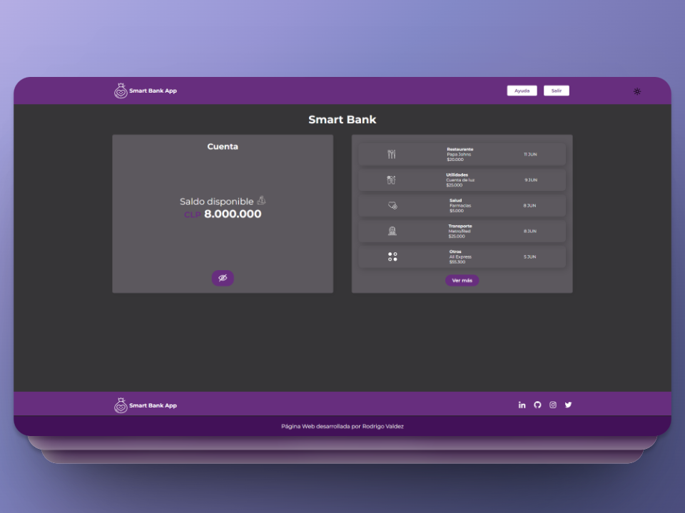

# Proyecto React y Styled Components de Alura Latam

Proyecto realizado utilizando lo enseñado en el curso llamado **React: Utilizando Styled Components** en el cual se utiliza la librería React junto a la librería Styled Components. EL proyecto implementa la librería ya sea instalándola como dependencia en el proyecto e importando funciones. En el curso se da estilo global vía la función `createGlobalStyle` de styled components y se utiliza la función `ThemeProvider` a la cual se le pasa la props theme para luego capturarla en las funciones definidas con styled components y aplicar estilos condicionales vía el método de objetos (no el método switch y case). Los temas (variables) se almacenan como objetos en el archivo **temas.js**. Lo anterior permite implementar la funcionalidad de Tema Oscuro y Tema Diurno lo cual es algo muy importante en la accesibilidad de las paginas web actualmente.

He creado un **footer** el cual no es implementado por el instructor y además he realizado el **desafío** dejado por el instructor [Harland Lohora](https://github.com/HarlandLohora) el que consiste en almacenar el estado de la variable que determina el día o noche en el localstorage del navegador el cual permite recordar el estado dejado anteriormente por el usuario.

Se ha creado un footer como actividad del curso, el cual consta de un acceso a la pagina principal y un apartado con el acceso a redes sociales, dichos accesos estan ligados tambien al tema aplicado en el navegador (Oscuro y Diurno).

# Imagen del Proyecto

### Estado Día

### Estado Noche

